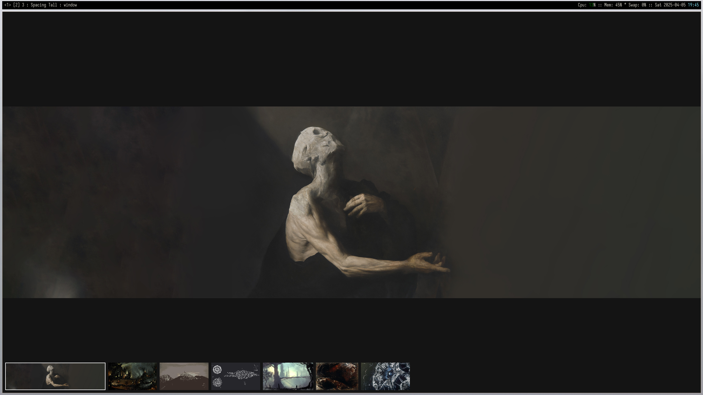

# mado

An extremely lightweight image viewer written in [Odin](https://odin-lang.org/) with [SDL3](https://wiki.libsdl.org/SDL3/FrontPage). Please keep in mind this is new and unstable softare mainly intended for personal use.

## License

Licensed under MIT
